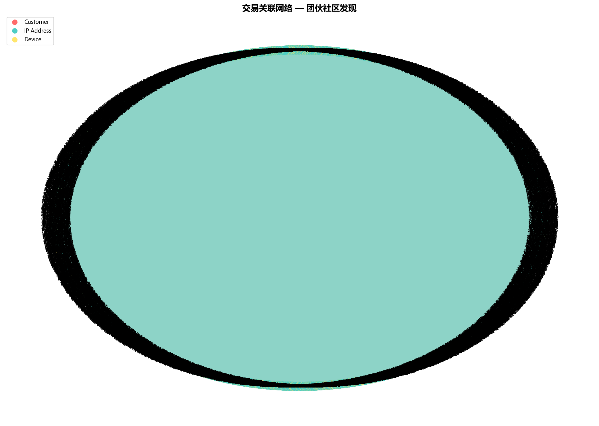

# Nexus-Audit

> 基于 Agentic AI 的下一代智能审计系统及主动风险防御体系  
> **2026 Digital Camp 德勤数字化精英挑战赛 — Team I**

## 系统架构

```
CSV 数据源 (52.5万条)
    │
    ▼
┌─────────────┐     ┌──────────────┐     ┌─────────────┐     ┌─────────────┐
│ Ingest Agent│────▶│Pattern Agent │────▶│ Risk Agent  │────▶│ Alert Agent │
│  数据清洗    │     │ 模式识别      │     │ LLM风险推理  │     │ 报告生成     │
│  23s        │     │ 352s         │     │ 806s        │     │ 16s         │
└─────────────┘     └──────────────┘     └─────────────┘     └─────────────┘
                           │                    │
                     ┌─────┴─────┐        ┌─────┴─────┐
                     │ 语义记忆   │        │ 情景记忆   │
                     │ 规则自进化  │        │ SQLite    │
                     └───────────┘        └───────────┘
```

## 实测结果

| 指标 | 数据 |
|------|------|
| 原始交易 | 525,511 条 (UCI Online Retail II + 50条注入异常) |
| 有效交易 | 407,714 条 |
| 可疑交易 | 19,263 条 |
| 高风险 | 5,086 笔 |
| 中风险 | 14,177 笔 |
| 审计警报 | 20 个团伙 |
| 涉案总额 | $393,696 |
| 注入异常召回率 | 100% (50/50) |
| 端到端耗时 | ~20 分钟 (vs 传统人工 8 小时) |

## 技术栈

| 组件 | 技术选型 |
|------|----------|
| Agent 编排 | Python 函数式管道 (可迁移至 LangGraph) |
| 图分析 | NetworkX + Louvain 社区发现 |
| LLM 推理 | OpenAI GPT-4o (含规则引擎回退) |
| 数据库 | SQLite |
| Demo UI | Streamlit |
| 数据验证 | Pydantic v2 |

## 快速开始

```bash
# 克隆仓库
git clone https://github.com/sunruize93-cmyk/nexus-audit.git
cd nexus-audit

# 创建虚拟环境
python -m venv .venv
.venv\Scripts\activate   # Windows
# source .venv/bin/activate  # macOS/Linux

# 安装依赖
pip install -r requirements.txt

# 配置环境变量 (可选, 不配置则使用规则引擎回退)
cp .env.example .env
# 编辑 .env 填入 OPENAI_API_KEY

# 准备数据 (首次运行自动下载 UCI 数据集)
python -c "from data.inject_anomaly import run; run()"

# 运行完整管道
python main.py

# 输出精简摘要 (适合截图)
python main.py --summary

# 启动 Demo Dashboard
streamlit run ui/app.py
```

## 项目结构

```
nexus-audit/
├── agents/           # 4 个核心 Agent
│   ├── ingest.py     #   数据清洗 + 格式标准化
│   ├── pattern.py    #   时间聚集 + 图网络社区发现
│   ├── risk.py       #   LLM CoT 风险推理
│   └── alert.py      #   报告生成 + 团伙图谱
├── graph/
│   └── network.py    # NetworkX 图构建 + Louvain
├── memory/
│   ├── working.py    # 工作记忆 (当前批次缓存)
│   ├── episodic.py   # 情景记忆 (SQLite 历史案例)
│   └── semantic.py   # 语义记忆 (规则自进化)
├── data/
│   ├── download_dataset.py
│   └── inject_anomaly.py  # 异常注入 (50条刷单)
├── ui/
│   └── app.py        # Streamlit Dashboard
├── output/           # 生成的审计报告 + 图谱
├── models.py         # Pydantic 数据模型
├── config.py         # 集中配置
└── main.py           # 管道入口
```

## 输出示例

运行 `python main.py --summary` 后输出精简摘要表格:



详细审计报告见 [`output/SUMMARY_REPORT.md`](output/SUMMARY_REPORT.md)

## License

MIT
